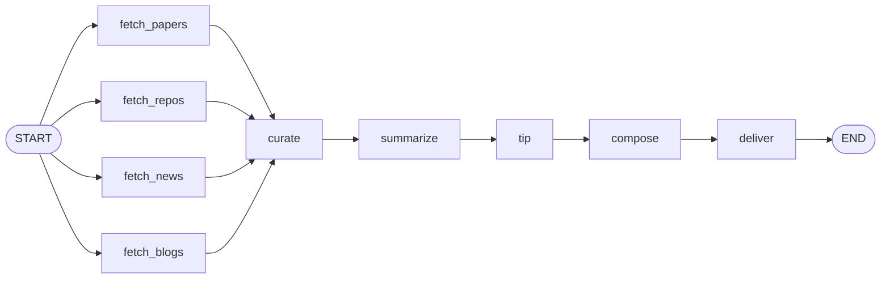

# Agent Signal

> Nineteen things worth reading, pulled from the daily AI firehose.

[简体中文](README.md) | **English**

A daily AI intelligence agent built on [LangGraph](https://github.com/langchain-ai/langgraph). It fetches four classes of sources in parallel, deduplicates and time-filters them with plain rules, then hands the survivors to an LLM that scores, selects, and summarizes them into a Chinese-language digest delivered by email and archived locally.

Measured per run: **187 items fetched → 19 selected**, about 70 seconds, roughly 4,500 LLM tokens.

---

## What's in the digest

| Section | Sources | Items/day |
|---|---|---|
| Papers | arXiv (`cs.AI` / `cs.CL` / `cs.MA`) | 5 |
| Repositories | GitHub, two-track search (rising + established) | 5 |
| Industry news | TechCrunch, The Verge, MIT Tech Review, Ars Technica, VentureBeat, Hacker News | 6 |
| Product releases | OpenAI, Google DeepMind, Hugging Face, Microsoft Research, Google Research | 3 |
| Agent dev tip of the day | Distilled from that day's items, with runnable code | 1 |

---

## Pipeline



| Node | Responsibility | Uses LLM |
|---|---|---|
| `fetch_*` | Four parallel fetches; results merged automatically by a reducer | — |
| `curate` | Dedupe → time filter → per-source cap → sort and truncate into a candidate pool | — |
| `summarize` | One call per section: selects, scores, and writes summaries in a single pass | ✅ |
| `tip` | Distills one hands-on development tip from the day's items | ✅ |
| `compose` | Renders Markdown and JSON | — |
| `deliver` | Writes to `output/`, sends email | — |

---

## Quick start

```bash
git clone https://github.com/yz5166-byte/Agent-Signal.git
cd Agent-Signal

python3 -m venv venv
source venv/bin/activate
pip install -r requirements.txt

cp .env.example .env   # fill in per the table below
python -m src.main
```

> Use `python -m src.main`, not `python src/main.py`. The former puts the project
> root on the module search path; the latter puts only the script's own directory
> there, which fails with `ModuleNotFoundError: No module named 'src'`.

Output lands in `output/YYYY-MM-DD.md` and `.json`.

### Environment variables

| Variable | Required | Notes |
|---|---|---|
| `LLM_API_KEY` | ✅ | API key for the LLM service |
| `LLM_BASE_URL` | ✅ | OpenAI-compatible endpoint, e.g. `https://aihubmix.com/v1` (**the trailing `/v1` is not optional**) |
| `LLM_MODEL_ID` | ✅ | Model ID, e.g. `deepseek-v4-flash` |
| `GITHUB_TOKEN` | — | Optional. Raises the Search API limit from 10/min to 30/min |
| `SMTP_HOST` / `SMTP_PORT` | — | Leave blank to skip email and write files only |
| `SMTP_USER` / `SMTP_PASSWORD` | — | Gmail requires an [app password](https://myaccount.google.com/apppasswords); account passwords will not work |
| `MAIL_TO` | — | Recipient address |

### Debugging a single source

Every source is independent of LangGraph and runs on its own:

```bash
python -m src.sources.arxiv
python -m src.sources.github
python -m src.sources.news_rss
python -m src.sources.official_blogs
```

---

## Layout

```
Agent-Signal/
├── src/
│   ├── models.py            # Item: one normalized piece of news, project-wide
│   ├── state.py             # ReportState: the graph's shared memory
│   ├── llm.py               # The single place a model is constructed
│   ├── graph.py             # Wiring only — read this to understand the pipeline
│   ├── main.py              # Entry point
│   ├── sources/             # HOW DATA IS FETCHED — no LangGraph, runs standalone
│   │   ├── _shared.py       #   underscore prefix = helper, not a source
│   │   ├── _rss.py
│   │   ├── arxiv.py         #   no underscore = a source, always exposes fetch()
│   │   ├── github.py
│   │   ├── news_rss.py
│   │   └── official_blogs.py
│   ├── nodes/               # WHAT EACH STEP DOES TO STATE — all (state) -> dict
│   │   ├── fetch.py
│   │   ├── curate.py
│   │   ├── summarize.py
│   │   ├── tip.py
│   │   ├── compose.py
│   │   └── deliver.py
│   └── delivery/            # WHERE IT GOES — split by channel
│       ├── files.py
│       └── email.py
├── web/                     # Web viewer (in progress)
└── output/                  # Daily digest archive
```

---

## Design notes

**`sources/` and `nodes/` are separate layers.** Everything in `sources/` is a plain function that knows nothing about LangGraph and can be run on its own; `nodes/` only calls it and writes the result into State. When something breaks: wrong data → look in `sources/`, wrong flow → `nodes/`, wrong order → `graph.py`.

**Adding a source costs one new file and three lines.** The `raw_items` field carries an `operator.add` reducer, so results returned in parallel by the fetch nodes are merged by LangGraph itself — the fact of "how many sources exist" lives in no line of code.

**GitHub uses two search tracks with reserved quotas.** There is no star-velocity endpoint, so "created recently yet already highly starred" stands in for "growing fast." But star counts are not comparable across the two tracks — established projects have had years to accumulate — and merging them under a single star sort lets the established track crowd out the rising one **14 to 1**. The fix is to write the track into the `source` field and reuse the existing per-source cap, so `curate` needs no repo-specific logic at all.

**Rule-based and LLM-based filtering have a clean split.** `curate` only decides what a machine can decide reliably — duplicates, staleness, source quotas — narrowing 187 items to 60 candidates. Judging what is *worth reading* requires understanding the content, so it is left entirely to the LLM.

**The whole pipeline degrades gracefully.** See below.

---

## Failure behavior

No single failure costs you the day's digest:

| Failure | Result |
|---|---|
| An entire source goes down | That section is empty; the other three proceed |
| One RSS feed goes down | One outlet missing; the rest proceed |
| One GitHub search track fails | The other track proceeds |
| An LLM call fails for a section | Falls back to the top N candidates — content, but no summaries |
| Tip generation fails | The section is simply omitted |
| Email delivery fails | Files are already on disk; the run does not exit non-zero |

Every failure is collected into `state["errors"]`, **printed in the digest footer**, and included in the JSON. When the digest looks thin, you can see exactly why.

---

## Status

- [x] Four-way parallel fetch (arXiv / GitHub / news RSS / official blogs)
- [x] Rule-based curation: dedupe, time filter, per-source cap
- [x] LLM scoring, selection, and Chinese summaries
- [x] Daily agent development tip
- [x] Markdown and JSON output
- [x] Local archive plus Gmail delivery
- [x] End-to-end graceful degradation
- [x] Scheduled daily runs via GitHub Actions (08:43 Asia/Shanghai, digest auto-committed back)
- [ ] Interactive web viewer
- [ ] Move tunables into `config.yaml` (currently module-level constants)

---

## Stack

LangGraph · LangChain · Pydantic · httpx · feedparser · FastAPI · Python 3.13
