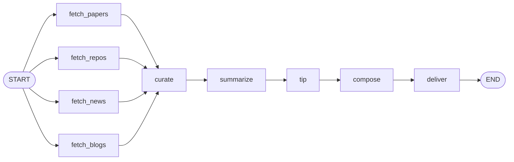

# Agent Signal

**简体中文** | [English](README.en.md)

基于 [LangGraph](https://github.com/langchain-ai/langgraph) 构建的每日 AI 资讯 Agent：并行抓取四类信源，规则去重与时效过滤后交给 LLM 打分挑选，产出中文日报，投递到邮箱与本地归档。

实测单次运行：**抓取 187 条 → 精选 19 条**，耗时约 70 秒，LLM 消耗约 4500 tokens。

---

## 日报包含什么

| 板块 | 数据源 | 每日条数 |
|---|---|---|
| 前沿论文 | arXiv（`cs.AI` / `cs.CL` / `cs.MA`） | 5 |
| 开源项目 | GitHub 双路检索（新星 + 经典） | 5 |
| 行业新闻 | TechCrunch、The Verge、MIT Tech Review、Ars Technica、VentureBeat、Hacker News | 6 |
| 产品发布 | OpenAI、Google DeepMind、Hugging Face、Microsoft Research、Google Research | 3 |
| 今日 Agent 开发技巧 | 由当天内容提炼，含可直接运行的代码 | 1 |

---

## 流水线



| 节点 | 职责 | 调 LLM |
|---|---|---|
| `fetch_*` | 四路并行抓取，结果靠 reducer 自动合并 | — |
| `curate` | 去重 → 时效过滤 → 单源限额 → 排序截断成候选池 | — |
| `summarize` | 每板块一次调用，同时完成挑选、打分、中文摘要 | ✅ |
| `tip` | 从当天条目里提炼一条可实操的开发技巧 | ✅ |
| `compose` | 排版成 Markdown 与 JSON 两种成品 | — |
| `deliver` | 写入 `output/`，发送邮件 | — |

---

## 快速开始

```bash
git clone https://github.com/yz5166-byte/Agent-Signal.git
cd Agent-Signal

python3 -m venv venv
source venv/bin/activate
pip install -r requirements.txt

cp .env.example .env   # 按下表填写
python -m src.main
```

> 必须用 `python -m src.main` 而不是 `python src/main.py`。
> 前者把项目根目录加入模块搜索路径，后者只加入脚本所在目录，会报 `ModuleNotFoundError: No module named 'src'`。

产出写在 `output/YYYY-MM-DD.md` 和 `.json`。

### 环境变量

| 变量 | 必填 | 说明 |
|---|---|---|
| `LLM_API_KEY` | ✅ | LLM 服务的 key |
| `LLM_BASE_URL` | ✅ | OpenAI 兼容接口地址，如 `https://aihubmix.com/v1`（**结尾的 `/v1` 不能省**） |
| `LLM_MODEL_ID` | ✅ | 模型 ID，如 `deepseek-v4-flash` |
| `GITHUB_TOKEN` | — | 留空可用。填了把 Search API 限额从 10 次/分钟提到 30 次/分钟 |
| `SMTP_HOST` / `SMTP_PORT` | — | 留空则跳过发信，只写本地文件 |
| `SMTP_USER` / `SMTP_PASSWORD` | — | Gmail 须用[应用专用密码](https://myaccount.google.com/apppasswords)，账号密码无效 |
| `MAIL_TO` | — | 收件地址 |

### 单独调试某个数据源

每个数据源都不依赖 LangGraph，可以单独运行：

```bash
python -m src.sources.arxiv
python -m src.sources.github
python -m src.sources.news_rss
python -m src.sources.official_blogs
```

---

## 目录结构

```
Agent-Signal/
├── src/
│   ├── models.py            # Item：全项目统一的「一条资讯」
│   ├── state.py             # ReportState：整张图的共享记忆
│   ├── llm.py               # 唯一初始化模型的地方
│   ├── graph.py             # 只做连线，读它就懂整条流水线
│   ├── main.py              # 入口
│   ├── sources/             # 【怎么拿数据】不依赖 LangGraph，可单独运行
│   │   ├── _shared.py       #   下划线前缀 = 助手，非数据源
│   │   ├── _rss.py
│   │   ├── arxiv.py         #   无下划线 = 数据源，必有 fetch()
│   │   ├── github.py
│   │   ├── news_rss.py
│   │   └── official_blogs.py
│   ├── nodes/               # 【这步对 State 做什么】统一签名 (state) -> dict
│   │   ├── fetch.py
│   │   ├── curate.py
│   │   ├── summarize.py
│   │   ├── tip.py
│   │   ├── compose.py
│   │   └── deliver.py
│   └── delivery/            # 【往哪送】按渠道拆分
│       ├── files.py
│       └── email.py
├── web/                     # 网页服务（开发中）
└── output/                  # 每日日报归档
```

---

## 设计要点

**`sources/` 与 `nodes/` 分层。** `sources/` 里是纯函数，完全不认识 LangGraph，可以单独运行调试；`nodes/` 只负责「调用它 + 塞进 State」。出问题时数据不对看 `sources/`，流程不对看 `nodes/`，顺序不对看 `graph.py`。

**加一个数据源的代价是「新增一个文件 + 三行」。** `raw_items` 字段带 `operator.add` reducer，四个 fetch 节点并行返回的结果由 LangGraph 自动合并——「总共有几个源」这件事不存在于任何一处代码里。

**GitHub 用两路检索并各留名额。** GitHub 没有「star 增速」接口，所以用「新建不久却已高星」近似「涨得快」。但两路的 star 数不可比（老项目有几年时间累积），直接按 star 合并排序时经典路会以 **14:1** 压制新星路。解法是把检索路径写进 `source` 字段，复用已有的单源限额机制，`curate` 里不需要任何 repo 专用逻辑。

**规则筛选与 LLM 筛选分工明确。** `curate` 只做机器能可靠判断的事（重复、过期、来源配额），把 187 条压到 60 条候选；「哪条更值得看」需要读懂内容，一条都不抢，全部交给 LLM。

**全链路降级。** 见下节。

---

## 容错行为

任何单点故障都不会让当天没有日报：

| 故障 | 表现 |
|---|---|
| 某个源整体挂掉 | 该板块为空，其余三路照常 |
| RSS 单个 feed 挂掉 | 少一家媒体，其余照常 |
| GitHub 单路检索失败 | 另一路照常 |
| 某板块 LLM 调用失败 | 退回候选池前 N 条，有内容但无摘要 |
| 技巧生成失败 | 不出这个栏目 |
| 邮件发送失败 | 文件已落盘，不以非零码退出 |

所有失败汇入 `state["errors"]`，**打印在日报页脚**，也写进 JSON。日报变薄时你能直接看到原因。

---

## 开发进度

- [x] 四路并行抓取（arXiv / GitHub / 新闻 RSS / 官方博客）
- [x] 规则精选：去重、时效过滤、单源限额
- [x] LLM 打分挑选 + 中文摘要
- [x] 每日 Agent 开发技巧
- [x] Markdown / JSON 双格式产出
- [x] 本地归档 + Gmail 邮件投递
- [x] 全链路容错降级
- [x] GitHub Actions 每日定时运行（北京时间 08:43，日报自动 commit 回仓库）
- [ ] 可交互网页
- [ ] 参数收进 `config.yaml`（目前写在各模块顶部的常量里）

---

## 技术栈

LangGraph · LangChain · Pydantic · httpx · feedparser · FastAPI · Python 3.13
